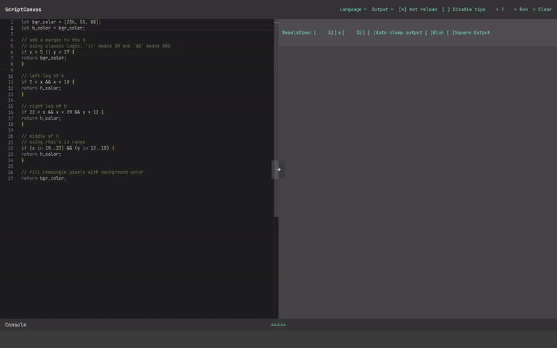
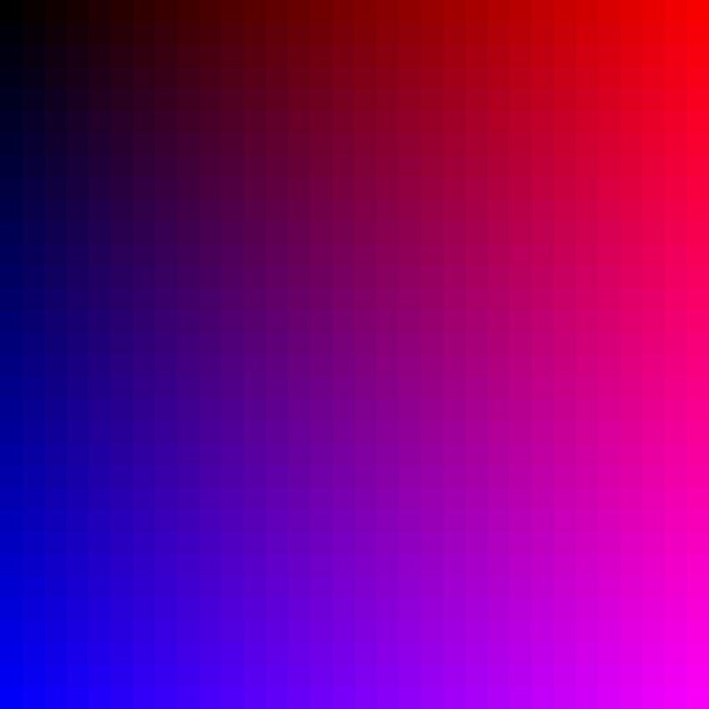
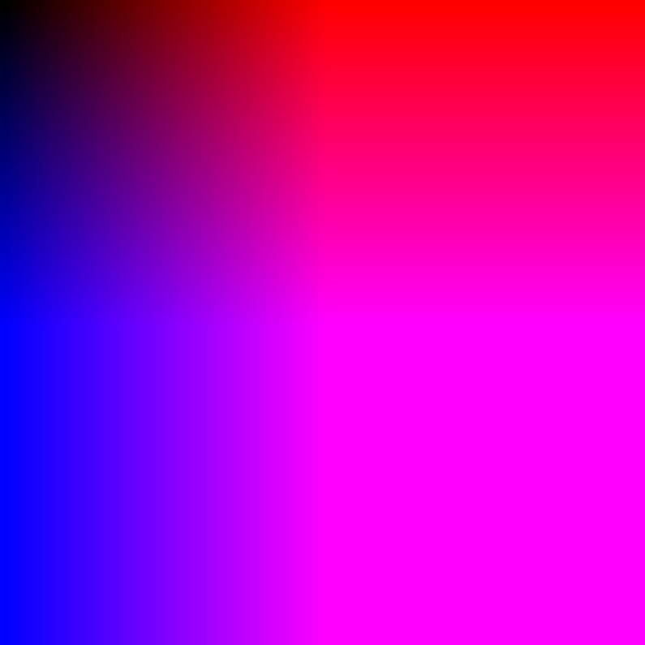

# [ScriptCanvas](https://m-mrk.github.io/ScriptCanvas)

<!-- markdownlint-disable MD013 -->
Static Web app for scripting logic and generating interesting outputs through simple logic.
<!-- markdownlint-enable MD013 -->



<!-- markdownlint-disable MD033 MD013 -->
<p align="center">
    <a href="https://m-mrk.github.io/ScriptCanvas/">

</a>
</p>
<!-- markdownlint-enable MD033 MD013-->

Created for and during [Hackclub's Stardance](https://stardance.hackclub.com/)

## Features

- Quick Rhai evaluation through Rust-WASM
- Grid and Plot output
- Monaco editor
- Responsive layout
- Tutorial and tips
- TUI like styling
- Hot reloading

## Quick Example

Let's create a gradient in the Grid output!

```rhai
let amp = 8;

let r = x*amp;
let b = y*amp;

[r, 0, b]
```

This simple script results in this gradient:

<!-- markdownlint-disable MD033 MD013 -->
<table width="100%" style="border-collapse: collapse; border: none;">
  <tr>
    <td width="48%" align="center" style="border: none; padding: 5px;">
      
      <p><em>Made with 32x32 resolution and blur off</em></p>
    </td>
    <td width="4%" style="border: none;"></td><!-- Künstlicher Abstandshalter (Gap) -->
    <td width="48%" align="center" style="border: none; padding: 5px;">
      
      <p><em>Made with 64x64 resolution, blur on and auto-clamp on</em></p>
    </td>
  </tr>
</table>
<!-- markdownlint-enable MD033 MD013 -->

The script is run over each pixel in the grid and returns that pixel's color.
On each run the values of x and y represent the pixel's coordinates.
So the pixel's get more blue along the y-axis and more red along the x-axis.
We also amplify this change by the *amp* variable to make it more noticeable.

For more examples and an in-depth explanation check out the tutorial [in the app](https://m-mrk.github.io/ScriptCanvas)!
The tutorial is always replayable under `> ?` -> `Actions` -> `Start Tutorial`

## Inner workings

1. **Performance**
Scripts are evaluated in a web worker so it doesn't stall the main UI thread.
Scripts are pre-compiled to ASTs.
Optimized rust WASM evaluates the script across the different scopes.
Time per pixel in the Grid output is around 0.004ms.
Meaning that it takes ~0.26s to render a 256x256 grid.

2. **Script language**
Uses Rhai, which has a similar syntax to rust and js.
The Math and Sci packages for rhai are available.
Many functions are overloaded to easily support both i64 and f64 for easier use.

3. **Architecture**
Everything can be hosted statically and no server is needed.
Built without any web framework, only vite for TS.

4. **Modularity**
The UI is built with easy expansion in mind.
The generic state and output system should allow easy appending of outputs.

5. **UI**
The console is virtualized and doesn't dump thousands of nodes into the DOM.
Tabbed layout should make the UI work even on smallish screens.
Features like Hot-Reload allow a hassle-free workflow.

## Run locally

1. Clone the repo
2. navigate to `web/` folder
3. install web dependencies with `npm ci`
4. install [rust](https://rust-lang.org/tools/install/) and [wasm-pack](https://wasm-bindgen.github.io/wasm-pack/)
5. build with `npm run build`

The following npm scripts are available (`npm run NAME`):

- `preview` to preview the build
- `dev` to launch the vite dev server
- `build:wasm` to just compile and optimize the rust WASM
- `build:web` to just build the web stuff with vite

The repo is split into `core_engine` and `web`.
`core_engine` includes all the rust code for the evaluation of the scripts.
`web` holds everything else including the ui and glue in between.
